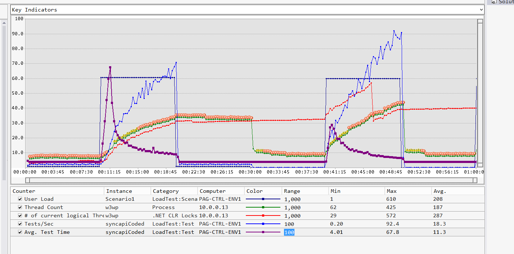

# Synchronous I/O

A synchronous I/O operation blocks the calling thread while the I/O completes. The calling thread is effectively suspended and unable to perform useful work during this interval. The result is that processing resources are wasted. In a cloud-based web application or service which serves multiple concurrent requests, this approach can adversely affect the scalability of the system.

Common examples of synchronous I/O include:

- Writing to a local file and waiting for the data to be saved.
- Retrieving or persisting data to a database.
- Posting a message to a message queue and waiting for the message queue to acknowledge receipt of the message.
- Sending a request to a web service and waiting for a response.

This anti-pattern typically occurs because:

- It appears to be the most intuitive way to perform an operation. For example, the following code looks to be the obvious way to post a message to an Azure Service Bus queue:

**C#**

``` C#
// Create a QueueClient object to connect to the queue
QueueClient client = ...;
// Create a message to post on the queue
BrokeredMessage message = ...;
// Post the message
client.Send(message);
```

- The application requires a response from the request, as shown by the following code example which sends an HTTP GET request to a web service and then displays the result:

**C#**

``` C#
// Construct an HTTP web request
HttpWebRequest request = (HttpWebRequest)WebRequest.Create(new Uri("http://..."));
request.Method = "GET";
request.ContentType = "application/json";

// Send the request and wait for the response
HttpWebResponse response = (HttpWebResponse)request.GetResponse();

// Process the response
if (response.StatusCode == HttpStatusCode.OK)
{
    using (var responseStream = response.GetResponseStream())
    {
        if (responseStream != null)
        {
            using (var responseReader = new StreamReader(responseStream))
            {
                string result = responseReader.ReadToEnd();
                Console.WriteLine("{0}", result);
            }
        }
    }
}
```


- The application uses a library which performs I/O and that does not provide asynchronous operations. For example:

**C#**

``` C#
var result = LibraryIOOperation();
// Wait while the method completes

Console.WriteLine("{0}", result);
```

[Link to the related sample][fullDemonstrationOfProblem]

## How to detect the problem
From the viewpoint of a user running an application that performs synchronous I/O operations, the system can seem unresponsive or appear to hang periodically. The application may even fail with timeout exceptions.

An operator monitoring a system that performs synchronous I/O operations may observe the following phenomena:

- The `Processor\% Processor Time` performance counter for each processor is low for extended periods of time *(NOTE: NEED TO SPECIFY A VALUE e.g. below 30%)*.
- The `System\Processor Queue Length` performance counter indicates that many processes are blocked awaiting CPU resources *(NOTE: NEED TO QUANTIFY - WHAT SHOULD THE IDEAL QUEUE LENGTH BE?)*
- The `Memory\Available Bytes` performance counter regularly indicates that the amount of free memory is less than 10% of the available memory.
- If the application is performing disk I/O, the `PhysicalDisk\Avg. Disk Queue Length` for disks accessed by the application indicate a persistent backlog of I/O requests. A sustained queue length above 5 could indicate a disk subsystem bottleneck (**Note:** The application should ensure that disks used for paging process memory are kept distinct from those used to store application data).
- The `HttpWebRequest` performance counters on a machine hosting a web service ... *(NOTE: MORE DETAILS TO BE ADDED)*

Profiling the application can identify long-running method-calls and the amount of CPU time spent while running these methods. If a long-running method accounts for a minimal amount of CPU time, then examine this method to determine whether it is blocking by performing synchronous I/O operations *(NOTE: NEED TO QUANTIFY THIS AND POSSIBLY ADD MORE DETAILS)*.

## How to correct the problem
Replace synchronous I/O operations with asynchronous requests.

Some libraries provide asynchronous versions of the available I/O operations. For example, the following code posts a message to a Service Bus queue asynchronously.

**C#**

``` C#
// Create a QueueClient object to connect to the queue
QueueClient client = ...;
// Create a message to post on the queue
BrokeredMessage message = ...;
// Post the message asynchrously
client.SendAsync(message);

// Processing continues while the Send operation is performed asynchronously
Console.WriteLine("Processing while message is sent");
...
```

The `SendAsync` method creates a new `Task` on which to perform the send operation. This task can run asynchronously on a separate thread from the code that called it. The use of the `SendAsync` method shown in this example is an illustration of the fire-and-forget technique;  the application invokes the `SendAsync` method but does not know whether the task has succeeded. To capture this information, use a continuation that runs when the task completes and has access to state information about the task:

**C#**

``` C#
...
Task sendTask = client.SendAsync(message);

// Specify a continuation that runs when the task completes
sendTask.ContinueWith((task) =>
{
    // Processing that runs when the task is complete.
    Console.WriteLine("SendAsync task status is {0}", task.Status);
});
...
```

The `HttpWebResponse` class used to obtain a response to a web request in the example shown earlier provides similar functionality. The `GetResponseAsync` method is an asynchronous version of the `GetResponse` method that also runs by creating a new task. You can use a continuation to capture and process the information returned by the web response in the same way as the previous example. However, note that some recent libraries only provide asynchronous versions of certain methods. These libraries are usually highly optimized for the asynchronous approach (as opposed to being asynchronous extensions of inherently synchronous methods). If possible, you should consider replacing code your synchronous code with these calls to these methods. An example is the `HttpClient` class in the `System.Net.Http` namespace. This class provides methods such as `GetAsync`, `PostAsync`, `PutAsync`, and `DeleteAsync` for interacting with a REST web service. The following code snippet could be used to replace the synchronous example shown earlier:

**C#**

``` C#
using (HttpClient client = new HttpClient())
{
    client.BaseAddress = new Uri("http://...");
    client.DefaultRequestHeaders.Accept.Clear();
    client.DefaultRequestHeaders.Accept.Add(new MediaTypeWithQualityHeaderValue("application/json"));

    HttpResponseMessage response = await client.GetAsync(...);
    if (response.IsSuccessStatusCode)
    {
        var result = await response.Content.ReadAsStringAsync();
        Console.WriteLine("{0}", result);
    }
}
```

Note that this code uses the `await` operator to return control to the calling environment while the asynchronous operation is performed. The subsequent code effectively acts as a continuation that runs when the asynchronous operation has completed.

For libraries that do not provide asynchronous versions of operations, you can create asynchronous wrappers around synchronous methods, as shown in the following example:

**C#**

``` C#
// Asynchronous wrapper around synchronous library method
private async Task<int> LibraryIOOperationAsync()
{
    return await Task.Run(() => LibraryIOOperation());
}

...
// Invoke the asynchronous wrapper using a task
var libraryTask = LibraryIOOperationAsync();

// Use a continuation to handle the result of the LibraryIOOperation method
libraryTask.ContinueWith((task) =>
{
    Console.WriteLine("Result from LibraryIOOperation is {0}", task.Result);
});

// Processing continues while the LibraryIOOperation method is run asynchronously
Console.WriteLine("Work performed while LibraryIOOperation is running asynchronously");
```


**Note:** Only use the asynchronous wrapper strategy for methods that are I/O bound. Following this approach for CPU bound operations offers little benefit, and is likely to actually decrease the overall throughput of the system due to the additional overhead of creating and managing tasks.

[Link to the related sample][fullDemonstrationOfSolution]


## How to validate the solution
The system should be able to support more concurrent user requests than before, and as a result be more scalable. This can be determined by performing load testing before and after making any changes to the code and then comparing the results. Functionally, the system should remain unchanged. Monitoring the system and analyzing the key performance counters described earlier should indicate that the system spends less time blocked by synchronous I/O and the CPUs are more active. *(NOTE: NEED TO ADD SOME QUANTIFIABLE GUIDANCE)*

## Perfomance Analysis

A request is received initially by HTTP.SYS at kernel level, which then posts the request to an IIS IO completion port. IIS picks the request from its thread pool and calls into ASP.NET which posts the request to the CLR thread pool, where then the request will be executed.

In synchronous operations where there is high latency and number of concurrent requests exceeds the CLR thread pool size low throughput and high response times will be observed. The following indicators can give the imbalance state of the system: .Net Clr Locks and Threads/# of Current Logical Threads/w3wp, Web service/Current Connections, Tests /sec, User Load, and Avg Test Time and Asp.net applications/Requests Executing. When user load and web connections out numbers the CLR physical threads or ASP.NET Requests Executing, then is an indication that operations are blocked in IIS thread pool waiting for a slot to be available in CLR thread pool where ASP.NET will post the request to be executed. Cloud Services Web sites will provision a mechanism to compensate such imbalance by allowing ASP.NET to increase the CLR thread pool gradually or at higher pace. The graph below depicts such behavior.


Cascading Synchronous calls for services will result is ripple effect of high latency, degrading throughput and availability in workloads with higher concurrent operations than normal business volumes. Another problem with the adjustment of threads to accommodate the incoming requests is that when workloads phase out the collection of resources will bring system back to its initial state, and the next surge of user activity will cause the same problem. Below is the depiction of a Load test representing a paced workload with a surge and low requests level over a period of time:



In asynchronous operations such resource allocation to satisfy the request is not required since the awaited call will relinquish the thread resource to the CLR thread pool, reducing the number of threads required to satisfy the request, increasing the throughput and increasing the requests executing. With this design the threads are shared among the requests. Below is the same representation comparing with Synchronous: with the average of CLR current Logical threads we have 3693 requests executing with throughput of 928 of completed tests / sec, versus


The coarsest level of measuring a transaction is tests / sec, available from the load test metrics. A request from ASP.net view is any operation that is invoked, that including resources that are dependent on root level to another request, as an example images, JavaScript resources etc. If a test contains only one web test request, then tests /sec will match the readings from asp.net requests /sec.

## What problems will this uncover?
*TBD - Need more input from the developers*.

This section is very contextual and may not exist for every pattern. The idea is that fixing one problem in a system will likely reveal other problems that were not visible before. We want to give the reader a sense of what they can expect.
For example, increasing the the throughput of your front-end web service may result in overwhelming a downstream service that was previously thought to "run fine".

[fullDemonstrationOfProblem]: http://github.com/mspnp/performance-optimization/xyz
[fullDemonstrationOfSolution]: http://github.com/mspnp/performance-optimization/123
